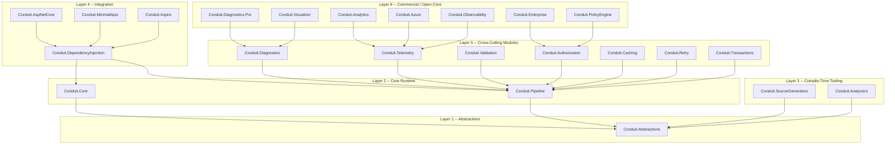
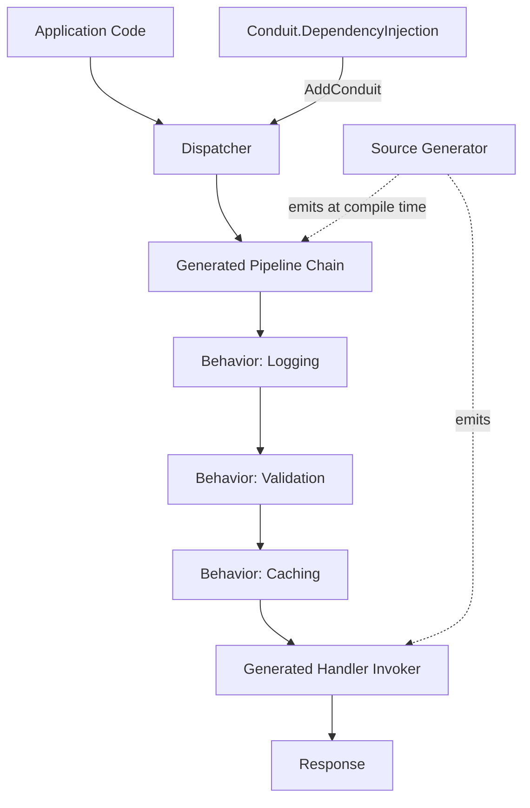

# 03 — High-Level Architecture

## Layers

Conduit is organized into six architectural layers, each with a strict, one-directional dependency rule: a layer may depend only on layers above it (closer to Abstractions), never below.

## Layer Responsibilities

| Layer | Projects | Responsibility |
|---|---|---|
| 1. Abstractions | `Conduit.Abstractions` | Pure contracts: `IRequest<T>`, `IRequestHandler<T,R>`, `IPipelineBehavior<T,R>`, `INotification`, marker interfaces. Zero implementation, zero dependencies beyond `System.*`. |
| 2. Core Runtime | `Conduit.Core`, `Conduit.Pipeline` | The dispatcher contract and default runtime pieces that consume generated code: `ISender`, `IPublisher`, pipeline execution primitives, context types. |
| 3. Compile-Time Tooling | `Conduit.SourceGenerators`, `Conduit.Analyzers` | Incremental Generators that emit handler registration, dispatcher partial classes, and DI extension methods; Roslyn analyzers that validate usage at edit time. |
| 4. Integration | `Conduit.DependencyInjection`, `Conduit.AspNetCore`, `Conduit.MinimalApis`, `Conduit.Aspire` | Glue into hosting models: `IServiceCollection` extensions, ASP.NET Core middleware, Minimal API endpoint filters, .NET Aspire service defaults. |
| 5. Cross-Cutting Modules (OSS) | `Conduit.Diagnostics`, `Conduit.Telemetry`, `Conduit.Validation`, `Conduit.Authorization`, `Conduit.Caching`, `Conduit.Retry`, `Conduit.Transactions` | Optional behaviors implemented as `IPipelineBehavior<T,R>` decorators. Each is independently installable and depends only on Core/Pipeline. |
| 6. Commercial / Open-Core | `Conduit.Diagnostics.Pro`, `Conduit.Visualizer`, `Conduit.Analytics`, `Conduit.Enterprise`, `Conduit.Azure`, `Conduit.Observability`, `Conduit.PolicyEngine` | Advanced, licensed extensions of Layer 5 modules — never required for core functionality; the pipeline itself never depends on them. |

## Dependency Direction Rules

1. **Abstractions has zero dependents-facing coupling** — nothing in `Conduit.Abstractions` references DI, logging, or any concrete runtime type. This is what lets analyzers and generators reference it without pulling in the runtime.
2. **Core Runtime depends only on Abstractions.** The dispatcher's public contracts (`ISender`, `IPublisher`) are defined here; the actual dispatch bodies are generated per-consuming-assembly by the source generator (Layer 3) and therefore Core has no reflection-based fallback.
3. **Compile-Time Tooling depends only on Abstractions** (plus the Roslyn/Roslyn.CodeAnalysis SDK) — generators and analyzers must never reference `Conduit.Core` at runtime because they execute inside the compiler process, not the application process.
4. **Integration depends on Core Runtime + DI**, never the reverse: `Conduit.AspNetCore` knows about Conduit; Conduit's core never references ASP.NET Core types.
5. **Cross-Cutting Modules depend only on Core/Pipeline abstractions** (`IPipelineBehavior<T,R>`), so they can be added/removed independently without cascading changes.
6. **Commercial packages depend on their OSS counterpart**, never the other way — `Conduit.Core` and `Conduit.Pipeline` have *zero* awareness that commercial packages exist. This is the structural guarantee behind "the pipeline is free forever."

## Request Flow (Illustrative)

At compile time, the source generator scans the consuming assembly's syntax trees for `IRequestHandler<TRequest,TResponse>` implementations and registered `IPipelineBehavior<,>` types, and emits:

- A partial `ConduitDispatcher` class with one strongly-typed `Send` overload path per request type (via a generated `switch`-free, monomorphic invocation table keyed by compile-time type identity).
- An `AddConduit()` `IServiceCollection` extension that registers each handler and behavior with the correct lifetime — no `Assembly.GetTypes()` call anywhere.

This flow never touches reflection: everything downstream of "Application Code calls `Send`" is either a virtual call into a generated, concretely-typed method or a normal DI-resolved constructor injection.
