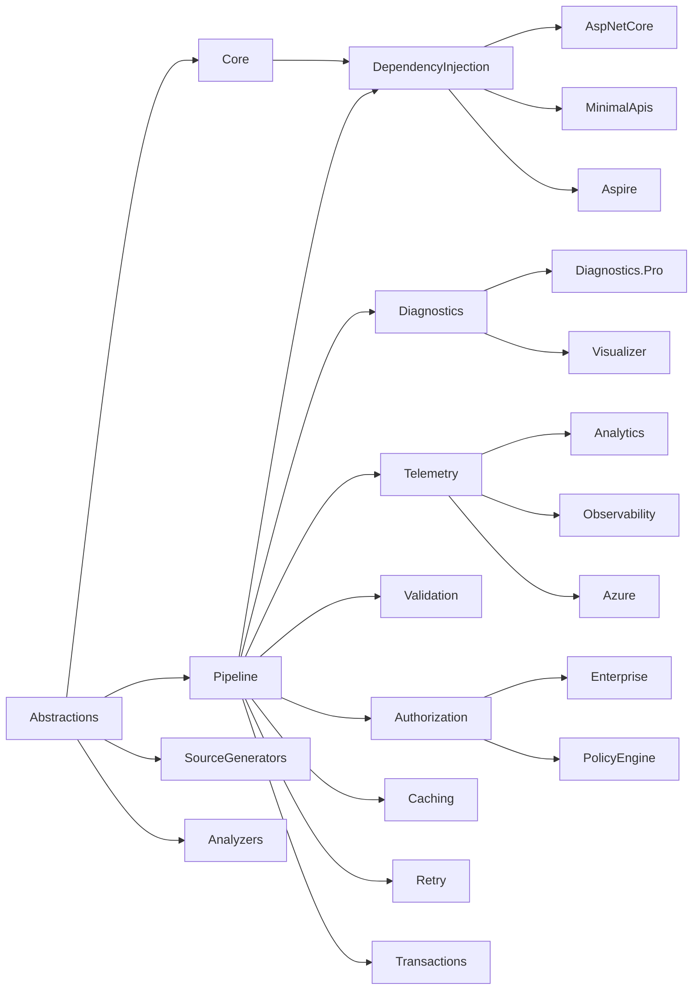

# 04 — Complete Solution Structure

## Repository Layout

```
Conduit.sln
src/
  Conduit.Abstractions/
  Conduit.Core/
  Conduit.Pipeline/
  Conduit.SourceGenerators/
  Conduit.Analyzers/
  Conduit.DependencyInjection/
  Conduit.AspNetCore/
  Conduit.MinimalApis/
  Conduit.Aspire/
  Conduit.Diagnostics/
  Conduit.Telemetry/
  Conduit.Validation/
  Conduit.Authorization/
  Conduit.Caching/
  Conduit.Retry/
  Conduit.Transactions/
  Conduit.Testing/
  commercial/
    Conduit.Diagnostics.Pro/
    Conduit.Visualizer/
    Conduit.Analytics/
    Conduit.Enterprise/
    Conduit.Azure/
    Conduit.Observability/
    Conduit.PolicyEngine/
test/
  Conduit.Abstractions.Tests/
  Conduit.Core.Tests/
  Conduit.Pipeline.Tests/
  Conduit.SourceGenerators.Tests/
  Conduit.Analyzers.Tests/
  Conduit.DependencyInjection.Tests/
  Conduit.Integration.Tests/
  ... (one test project per src project, mirrored 1:1)
benchmarks/
  Conduit.Benchmarks/
templates/
  Conduit.Templates/
docs/
  architecture/  (this documentation set)
```

## Project-by-Project Justification

| Project | Assembly / NuGet package | Namespace | Why it exists |
|---|---|---|---|
| `Conduit.Abstractions` | `Conduit.Abstractions` | `Conduit.Abstractions` | Contract-only assembly. Lets analyzers, generators, and third-party libraries depend on Conduit's types without pulling in any runtime behavior. |
| `Conduit.Core` | `Conduit.Core` | `Conduit.Core` | Defines `ISender`, `IPublisher`, request/response context types, exception hierarchy. The "front door" a developer calls into. |
| `Conduit.Pipeline` | `Conduit.Pipeline` | `Conduit.Pipeline` | Pipeline composition primitives: `IPipelineBehavior<T,R>`, behavior ordering contracts, the pipeline execution delegate shape consumed by generated code. |
| `Conduit.SourceGenerators` | `Conduit.SourceGenerators` (analyzer package, `DevelopmentDependency=true`) | `Conduit.SourceGenerators` | The Incremental Generator that emits handler/behavior registration and the dispatcher partial class. Ships as a Roslyn analyzer package, never a runtime dependency. |
| `Conduit.Analyzers` | `Conduit.Analyzers` (analyzer package) | `Conduit.Analyzers` | Diagnostic analyzers + code fixes (missing handler, mutable request, etc.). Also ships as an analyzer package. |
| `Conduit.DependencyInjection` | `Conduit.DependencyInjection` | `Conduit.DependencyInjection` | `AddConduit()` and related `IServiceCollection` extensions; hosts the `ConduitOptions` builder consumed by the generator's emitted code. |
| `Conduit.AspNetCore` | `Conduit.AspNetCore` | `Conduit.AspNetCore` | ASP.NET Core specific integration: exception-to-`ProblemDetails` mapping, request-scoped correlation, middleware. |
| `Conduit.MinimalApis` | `Conduit.MinimalApis` | `Conduit.MinimalApis` | `MapConduit<TRequest,TResponse>` endpoint mapping helpers for Minimal APIs, avoiding hand-written glue per endpoint. |
| `Conduit.Aspire` | `Conduit.Aspire` | `Conduit.Aspire` | .NET Aspire service-defaults integration: health checks, resilience defaults, OpenTelemetry wiring pre-configured for Conduit. |
| `Conduit.Diagnostics` | `Conduit.Diagnostics` | `Conduit.Diagnostics` | OSS diagnostics: pipeline shape introspection API, basic execution tracing, health checks. |
| `Conduit.Telemetry` | `Conduit.Telemetry` | `Conduit.Telemetry` | `ActivitySource`/`Meter`-based OpenTelemetry instrumentation behavior. |
| `Conduit.Validation` | `Conduit.Validation` | `Conduit.Validation` | Validation pipeline behavior abstraction + FluentValidation adapter. |
| `Conduit.Authorization` | `Conduit.Authorization` | `Conduit.Authorization` | Policy/claims-based authorization behavior built on `Microsoft.AspNetCore.Authorization` abstractions (usable outside ASP.NET Core too). |
| `Conduit.Caching` | `Conduit.Caching` | `Conduit.Caching` | Memory/distributed/hybrid caching behavior with pluggable key strategies. |
| `Conduit.Retry` | `Conduit.Retry` | `Conduit.Retry` | Transient-failure retry behavior built on `Microsoft.Extensions.Resilience`/Polly primitives. |
| `Conduit.Transactions` | `Conduit.Transactions` | `Conduit.Transactions` | Ambient/nested transaction behavior with EF Core `IDbContextTransaction` integration points. |
| `Conduit.Testing` | `Conduit.Testing` | `Conduit.Testing` | Test doubles: `FakeSender`, pipeline test harness, behavior-in-isolation test helpers. |
| `Conduit.Diagnostics.Pro` (commercial) | `Conduit.Diagnostics.Pro` | `Conduit.Diagnostics.Pro` | Advanced execution tracing, pipeline replay, time-travel debugging of past requests. |
| `Conduit.Visualizer` (commercial) | `Conduit.Visualizer` | `Conduit.Visualizer` | Live pipeline graph UI (web-based), rendering the compile-time-known pipeline shape plus live execution overlays. |
| `Conduit.Analytics` (commercial) | `Conduit.Analytics` | `Conduit.Analytics` | Historical performance analytics, SLA dashboards, regression detection across deployments. |
| `Conduit.Enterprise` (commercial) | `Conduit.Enterprise` | `Conduit.Enterprise` | Multi-tenant policy bundles, audit trail export, support SLA hooks. |
| `Conduit.Azure` (commercial) | `Conduit.Azure` | `Conduit.Azure` | Azure-native integrations: Key Vault-backed secrets for behaviors, Service Bus notification transport, Azure Monitor exporters. |
| `Conduit.Observability` (commercial) | `Conduit.Observability` | `Conduit.Observability` | Advanced OpenTelemetry exporters, adaptive sampling profiles, vendor-specific dashboards. |
| `Conduit.PolicyEngine` (commercial) | `Conduit.PolicyEngine` | `Conduit.PolicyEngine` | Declarative DSL for authorization/retry/caching policies, compiled to behaviors, editable without redeploying code. |
| `Conduit.Benchmarks` | (not published) | `Conduit.Benchmarks` | BenchmarkDotNet suite comparing Conduit against representative pipeline implementations. |
| `Conduit.Templates` | `Conduit.Templates` (`dotnet new` template pack) | n/a | `dotnet new conduit-webapi`, `dotnet new conduit-handler` project/item templates. |

## Folder Conventions Within Each Project

Each `src/Conduit.*` project follows the same internal folder shape to keep navigation predictable:

```
Conduit.<Module>/
  Abstractions/     (public interfaces specific to this module, if any)
  Internal/         (internal sealed implementation types)
  Extensions/       (public IServiceCollection / builder extension methods)
  Conduit.<Module>.csproj
```

## Solution-Level Dependency Graph (Package References)


