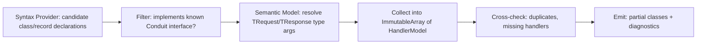

# 10 — Source Generator Architecture

## Why an Incremental Generator (not a legacy `ISourceGenerator`)

Incremental Generators (`IIncrementalGenerator`) cache pipeline stage outputs keyed by input equality, so an edit to one handler file re-runs only the stages affected by that file, not the whole generator over the whole compilation. For a framework whose entire value proposition is "compile-time work replaces runtime work," generator performance directly determines whether developers perceive Conduit as fast-to-iterate-with or a build-time tax — incremental generators are the only acceptable choice.

## Pipeline Stages



1. **Syntax Provider** (`ForAttributeWithMetadataName` or `CreateSyntaxProvider`): cheaply filters candidate `ClassDeclarationSyntax`/`RecordDeclarationSyntax` nodes by shape (implements an interface list containing `IRequestHandler`, etc.) without touching the semantic model — this is the fast, cacheable filter stage.
2. **Semantic Model Resolution**: for surviving candidates, resolves the `INamedTypeSymbol`, confirms it genuinely implements `Conduit.Abstractions.IRequestHandler<TRequest,TResponse>` (not just a same-named local interface), and extracts `TRequest`/`TResponse` as `ITypeSymbol`s.
3. **Model Collection**: symbols are projected into plain, `IEquatable` record models (`HandlerModel(string RequestType, string ResponseType, string HandlerType, ServiceLifetime Lifetime)`) — never symbols themselves are cached across stages, since `ISymbol` doesn't have useful equality across compilations; this is what makes the pipeline properly incremental.
4. **Cross-Check / Validation**: the full `ImmutableArray<HandlerModel>` for the compilation is diffed for duplicate `RequestType` entries (→ `CONDUIT002`) and requests with zero handlers (→ `CONDUIT001`), reported as `Diagnostic`s via `context.ReportDiagnostic`.
5. **Emission**: for a valid model set, `RegisterSourceOutput` emits the generated files described below.

## Generated Code Structure

For a consuming assembly `MyApp`, the generator emits (into the standard `obj/generated/Conduit.SourceGenerators/...` folder):

```
Conduit.SourceGenerators/Conduit.SourceGenerators.HandlerRegistrationGenerator/
  ConduitRegistration.g.cs         # partial AddConduit() implementation
  ConduitSender.g.cs               # partial ConduitSender dispatch methods
  ConduitDiagnostics.g.cs          # static pipeline metadata (for Conduit.Diagnostics)
```

**Naming convention**: `<GeneratorHintName>.g.cs`, one file per logical concern (registration / dispatch / diagnostics metadata) rather than one giant file, so incremental recompilation and code review of generated output stay manageable, and so `RegisterSourceOutput` calls can be independently cached.

## Partial Class Strategy

- `ConduitSender` is declared `partial` in `Conduit.Core` (hand-written) with only the `ISender` interface implementation contract documented via XML doc comments on non-partial parts; the generator contributes the concrete `SendXxx` methods and constructor parameter list in a separate partial declaration in the consuming assembly.
- `ConduitRegistration` is fully generator-owned (no hand-written partial) since it has no public surface beyond the single `AddConduit()` extension method that forwards to it.

This split means hand-written code (contracts, XML docs, base behavior) and generated code (mechanical wiring) never live in the same file, keeping "what did the generator actually produce" trivially answerable by looking at `obj/generated`.

## Generated Diagnostics & Metadata

Beyond registration code, the generator emits a static metadata table (`ConduitPipelineMetadata`) describing, for every request type: its handler type, its ordered behavior chain, and source locations — consumed by `Conduit.Diagnostics` for pipeline visualization ([Diagnostics](13-diagnostics.md)) without any runtime reflection, because the metadata is itself compile-time-generated literal data (arrays of `readonly record struct`).

## Compile-Time Validation

The generator performs structural validation that becomes **build errors**, complementing (not duplicating) the [Roslyn Analyzer Architecture](11-roslyn-analyzer-architecture.md):

| Check | Diagnostic ID | Severity |
|---|---|---|
| Request type with zero handlers | `CONDUIT001` | Error |
| Request type with multiple handlers | `CONDUIT002` | Error |
| Behavior registered for a request type that doesn't exist in the compilation | `CONDUIT003` | Warning |
| Handler's `TResponse` doesn't match `IRequest<TResponse>`'s declared response type | `CONDUIT004` | Error |

## File Naming Conventions

- Generator hint names: `PascalCase` matching the concern (`ConduitRegistration`, `ConduitSender`, `ConduitDiagnostics`), suffixed `.g.cs`.
- Generated namespaces mirror the consuming project's root namespace + `.Generated` (e.g. `MyApp.Generated`) to avoid any collision with hand-written types, and to make "is this file generated" visually obvious from a `using` statement or fully-qualified reference.

## Performance Considerations

- All pipeline stages after the syntax filter operate on small `ImmutableArray`s (handler count, not type count in the whole compilation), keeping the expensive semantic-model stage bounded to genuine candidates.
- `RegisterSourceOutput` is called with `IEquatable` model inputs so unrelated edits (e.g., changing a method body inside a handler that doesn't affect its signature) don't invalidate the cached output — verified in the generator's own test suite via the Roslyn `GeneratorDriver` incrementalism testing APIs (`RunGeneratorsAndUpdateCompilation` + tracking step diffing).
- The generator targets `netstandard2.0` (the Roslyn analyzer/generator compatibility floor) to run inside any host IDE/compiler version relevant to .NET 10 tooling, independent of the target framework of the consuming application.
