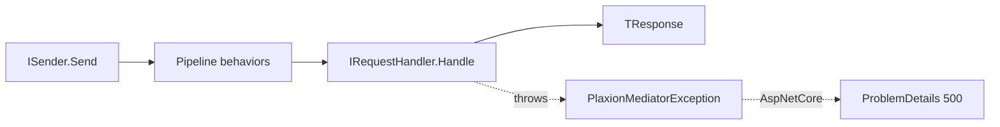

# Design Overview

PlaxionMediator's design principles:

- **Zero reflection at runtime.** Handler/behavior discovery and DI registration are emitted by an incremental Roslyn source generator (`PlaxionMediator.SourceGenerators`) at compile time.
- **Native AOT / trim safe by construction** — every shipped package sets `IsAotCompatible=true`.
- **Compile-time safety.** Missing or duplicate handlers are build errors (`PlaxionMediator001`/`PlaxionMediator002`), not runtime surprises.
- **Immutable-by-default requests** — `sealed record`s, enforced by `PlaxionMediator003` (mutable request analyzer).
- **Split `ISender`/`IPublisher` contracts** — request/response dispatch (`ISender.Send`) is separated from fan-out notifications (`IPublisher.Publish`), each with distinct failure semantics.
- **Performance-first.** Benchmarks show sub-microsecond overhead for typical request pipelines (see [Benchmarks](Benchmarks)).

## Core types

- `IRequest<TResponse>` / `IRequestHandler<TRequest, TResponse>` — one request, exactly one handler, returns `TResponse`.
- `INotification` / `INotificationHandler<TNotification>` — one notification, zero or more handlers (fan-out).
- `IPipelineBehavior<TRequest, TResponse>` — middleware around a request's `Handle` call (Validation, Caching, Circuit Breaker, Retry, etc.).
- `PlaxionMediatorException` (abstract) → `HandlerNotFoundException`, `PipelineExecutionException`, `PlaxionMediatorValidationException` — the core exception types the framework itself throws.

## Request lifecycle

