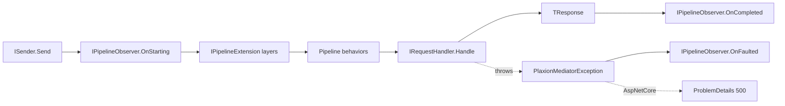

# Design Overview

PlaxionMediator's design principles:

- **Zero reflection at runtime.** Handler/behavior discovery and DI registration are emitted by an incremental Roslyn source generator (`PlaxionMediator.SourceGenerators`) at compile time.
- **Native AOT / trim safe by construction** — every shipped package sets `IsAotCompatible=true`.
- **Compile-time safety.** Missing or duplicate handlers are build errors (`PlaxionMediator001`/`PlaxionMediator002`), not runtime surprises.
- **Immutable-by-default requests** — `sealed record`s, enforced by `PlaxionMediator003` (mutable request analyzer).
- **Split `ISender`/`IPublisher` contracts** — request/response dispatch (`ISender.Send`) is separated from fan-out notifications (`IPublisher.Publish`), each with distinct failure semantics.
- **Performance-first.** Benchmarks show sub-microsecond overhead for typical request pipelines (see [Benchmarks](Benchmarks)).

## Core types

- `IRequest<TResponse>` / `IRequestHandler<TRequest, TResponse>` — one request, exactly one handler, returns `TResponse`.
- `INotification` / `INotificationHandler<TNotification>` — one notification, zero or more handlers (fan-out).
- `IPipelineBehavior<TRequest, TResponse>` — middleware around a request's `Handle` call (Validation, Caching, Circuit Breaker, Retry, etc.).
- `IPipelineExtension` / `PipelineExtensionBuilder` / `PipelineExtensionRegistry` — formal composition extension points that wrap the behavior+handler chain without replacing behaviors (see ADR-0007, "Formal Pipeline Extension Point Contract", in the `documentation` repo's `architecture/adr/` folder).
- `IPipelineObserver` / `PipelineObserverHub` — allocation-conscious start/stop/fault instrumentation seams for future telemetry packages (see ADR-0008, "Telemetry Hook Groundwork", in the `documentation` repo's `architecture/adr/` folder); no-op when unused.
- `PlaxionMediatorException` (abstract) → `HandlerNotFoundException`, `PipelineExecutionException`, `HandlerFaultException`, `PlaxionMediatorValidationException` — the core exception types the framework itself throws.

## Pipeline extension points (v0.6.0)

Custom composition outside `IPipelineBehavior<,>`:

```csharp
public sealed class TimingExtension : IPipelineExtension
{
    public int Order => 0; // lower = outermost

    public RequestHandlerDelegate<TResponse> Apply<TRequest, TResponse>(
        in PipelineExtensionContext context,
        RequestHandlerDelegate<TResponse> next)
        where TRequest : IRequest<TResponse>
    {
        return async () =>
        {
            // wrap next()
            return await next();
        };
    }
}

// Startup (AOT-safe, no reflection):
PipelineExtensionRegistry.Register(new TimingExtension());

// Optional: declare types for analyzers / docs (PlaxionMediator024/025):
new PipelineExtensionBuilder().Use<TimingExtension>();
```

Instrumentation without wrapping the chain:

```csharp
public sealed class MetricsObserver : IPipelineObserver
{
    public void OnStarting(in PipelineCallContext context) { /* Activity start in v0.7.0 */ }
    public void OnCompleted(in PipelineCallContext context) { }
    public void OnFaulted(in PipelineCallContext context, Exception exception) { }
}

PipelineObserverHub.Register(new MetricsObserver());
```

## Request lifecycle


```mermaid
graph LR
    Send[ISender.Send] --> ObsStart[IPipelineObserver.OnStarting]
    ObsStart --> Ext[IPipelineExtension layers]
    Ext --> Behaviors[Pipeline behaviors]
    Behaviors --> Handler[IRequestHandler.Handle]
    Handler --> Response[TResponse]
    Response --> ObsStop[IPipelineObserver.OnCompleted]
    Handler -. throws .-> Ex[PlaxionMediatorException]
    Ex --> ObsFault[IPipelineObserver.OnFaulted]
    Ex -. AspNetCore .-> Problem[ProblemDetails 500]
```
