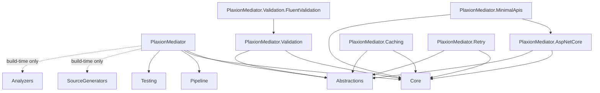

# Packages Overview

| Package | Role | Install it when... |
|---|---|---|
| `PlaxionMediator.Abstractions` | Contracts: `IRequest<>`, `IRequestHandler<,>`, `INotification`, `INotificationHandler<>`, pipeline behaviors | Always (transitive via `PlaxionMediator`) |
| `PlaxionMediator.Core` | `ISender`, `IPublisher`, the `PlaxionMediatorException` hierarchy (`HandlerNotFoundException`, `PipelineExecutionException`) | Always (transitive) |
| `PlaxionMediator.Pipeline` | Delegate-chain pipeline behavior composition | Always (transitive) |
| `PlaxionMediator.SourceGenerators` | Incremental generator that emits handler/behavior registration at compile time — zero reflection | Always (transitive, build-time only) |
| `PlaxionMediator.Analyzers` | Full analyzer catalog: missing/multiple handlers, mutable request, `CancellationToken` propagation, blocking calls, non-sealed handlers, duplicate registrations, performance anti-patterns | Always (transitive, build-time only) |
| `PlaxionMediator` | `AddPlaxionMediator()` extension wiring the generated registrations into `IServiceCollection` | **Install this one** — it bundles everything above |
| `PlaxionMediator.Testing` | `FakeSender` and other test doubles for unit-testing consumers of `ISender` | Always (transitive via `PlaxionMediator`) |
| `PlaxionMediator.AspNetCore` | `UsePlaxionMediatorExceptionHandling()` middleware + RFC 7807 `ProblemDetails` mapping for `PlaxionMediatorException` | Building any ASP.NET Core app (opt-in) |
| `PlaxionMediator.MinimalApis` | `MapPlaxionMediatorPost/Get/Put/Delete/Patch<TRequest,TResponse>()` Minimal API route helpers | Building a Minimal API app (opt-in, depends on `PlaxionMediator.AspNetCore`) |
| `PlaxionMediator.Validation` | `IPlaxionMediatorValidator<TRequest>`, `ValidationBehavior<TRequest,TResponse>` pipeline behavior | Implementing request validation (opt-in) |
| `PlaxionMediator.Validation.FluentValidation` | `FluentValidationAdapter<TRequest>` and DI extensions for wiring FluentValidation | Using FluentValidation for requests (opt-in, depends on `PlaxionMediator.Validation`) |
| `PlaxionMediator.Caching` | `ICacheableRequest<TResponse>`, `CachingBehavior<TRequest,TResponse>` pipeline behavior, and `IPlaxionMediatorCacheInvalidator` | Implementing request caching (opt-in, depends on `Microsoft.Extensions.Caching.Memory`) |
| `PlaxionMediator.Retry` | `IRetryableRequest`, `RetryBehavior<TRequest,TResponse>` pipeline behavior with backoff strategies | Implementing request retries (opt-in) |

## Why are `AspNetCore`/`MinimalApis` not bundled?

`PlaxionMediator` intentionally does **not** reference `PlaxionMediator.AspNetCore`/`PlaxionMediator.MinimalApis`. Those two packages pull in the full ASP.NET Core framework surface (`Microsoft.AspNetCore.App`), which would be forced onto every console app, worker service, or class library that only needs `AddPlaxionMediator()` — violating the zero-bloat, AOT-first design of the project. Web apps opt in explicitly:

```bash
dotnet add package PlaxionMediator.AspNetCore
dotnet add package PlaxionMediator.MinimalApis
```

## Dependency graph


